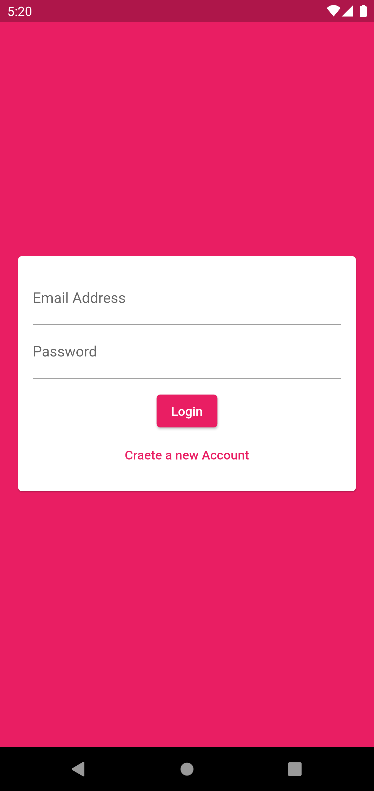

[![Contributors][contributors-shield]][contributors-url]
[![Forks][forks-shield]][forks-url]
[![Stargazers][stars-shield]][stars-url]
[![Issues][issues-shield]][issues-url]
[![MIT License][license-shield]][license-url]
[![LinkedIn][linkedin-shield]][linkedin-url]

<!-- PROJECT LOGO -->
<br />
<p align="center">
  <a href="https://github.com/WarMac4964/BaatCheet">
    
  </a>

  <h3 align="center">BaatCheet</h3>

  <p align="center">
    A cross platform text messaging app written in Flutter/Dart.
    <br />
    <br />
    ·
    <a href="https://github.com/WarMac4964/BaatCheet/issues">Report Bug</a>
    ·
    <a href="https://github.com/WarMac4964/BaatCheet/issues">Request Feature</a>
  </p>
</p>

<!-- TABLE OF CONTENTS -->
<details open="open">
  <summary>Table of Contents</summary>
  <ol>
    <li>
      <a href="#about-the-project">About The Project</a>
      <ul>
        <li><a href="#built-with">Built With</a></li>
        <li><a href="#Feature">Features</a></li>
      </ul>
    </li>
    <li>
      <a href="#getting-started">Getting Started</a>
    </li>
    <li><a href="#roadmap">Roadmap</a></li>
    <li><a href="#contact">Contact</a></li>
  </ol>
</details>

<!-- ABOUT THE PROJECT -->

## About The Project


<br>

BaatCheet is a cross-platform text messaging app for both Android and IOS written in Flutter/Dart.

### Built With

- [Flutter](https://flutter.dev/)
- [Dart](https://dart.dev/)
- [FireBase](https://firebase.google.com/)

### Features

- Send/Receive text messages
- Create your own profile.

<!-- GETTING STARTED -->

## Getting Started

To start with the project, you can simply download the [apk]() here or you can follow along the instructions to
download and run the whole project in emulator.

1. Clone the repo
   ```sh
   git clone https://github.com/WarMac4964/BaatCheet.git
   ```
2. Inside the project folder run
   ```sh
   flutter pub get
   ```
3. Open iOS/Android Emulator, For iOS the command is:
   ```sh
   open -a simulator
   ```
4. Then run the project using
   ```sh
   flutter run
   ```

<!-- ROADMAP -->

## Roadmap

- Adding end-to-end encryption.
- Allowing users to share their locations, photos, videos and audio files.
- Addition of story feature.

See the [open issues](https://github.com/WarMac4964/BaatCheet/issues) for a list of proposed features (and known issues).

<!-- CONTACT -->

## Contact

Anurag Tyagi - [@capttyg](https://www.instagram.com/capttyg/) - anurag.tyagi4964@gmail.com

Project Link: [https://github.com/WarMac4964/BaatCheet](https://github.com/WarMac4964/BaatCheet)

[contributors-shield]: https://img.shields.io/github/contributors/WarMac4964/BaatCheet.svg?style=for-the-badge
[contributors-url]: https://github.com/WarMac4964/BaatCheet/graphs/contributors
[forks-shield]: https://img.shields.io/github/forks/WarMac4964/BaatCheet.svg?style=for-the-badge
[forks-url]: https://github.com/WarMac4964/BaatCheet/network/members
[stars-shield]: https://img.shields.io/github/stars/WarMac4964/BaatCheet.svg?style=for-the-badge
[stars-url]: https://github.com/WarMac4964/BaatCheet/stargazers
[issues-shield]: https://img.shields.io/github/issues/WarMac4964/BaatCheet.svg?style=for-the-badge
[issues-url]: https://github.com/WarMac4964/BaatCheet/issues
[license-shield]: https://img.shields.io/github/license/WarMac4964/BaatCheet.svg?style=for-the-badge
[license-url]: https://github.com/WarMac4964/BaatCheet/blob/master/LICENSE.txt
[linkedin-shield]: https://img.shields.io/badge/-LinkedIn-black.svg?style=for-the-badge&logo=linkedin&colorB=555
[linkedin-url]: https://www.linkedin.com/in/anurag-tyagi-395425178/
[project-screenshot]: readme/screenshot.png
